# AIGC 个性化学习平台

[](LICENSE)
[](https://openjdk.org/)
[](https://spring.io/projects/spring-boot)
[](https://vuejs.org/)
[](https://vitejs.dev/)
[](https://element-plus.org/)

**基于 AIGC 与多资源整合的个性化学伴平台** —— 面向中国大学生的 AI 学习伴侣系统。

整合 B 站、小红书、抖音等公开课程链接，结合学习行为分析与大语言模型，将分散资源转化为结构化学习内容，生成符合个人节奏与应试目标的定制化学习路径。

> 毕业设计项目 · 浙江工业大学 · 信息管理与信息系统  
> 技术栈：**Spring Boot + Vue 3 + MySQL + Redis + 通义千问**

---

## 研究背景

随着生成式人工智能（AIGC）技术发展，教育模式正逐步向个性化与智能化转变。大学生广泛依赖 B 站、小红书、抖音等平台获取学习资源，但这些资源普遍存在 **分散、结构缺失、缺乏引导** 等问题，难以满足应试导向下的高效学习需求。

本平台以 **「链接而非搬运」** 为核心理念，构建四大能力闭环：

| 模块 | 说明 |
|------|------|
| 资源重组 | 多平台资源采集、标签分类、知识点结构化映射 |
| 学习画像 | 问卷测评 + 行为数据，生成 LQAI 学格与学习特征 |
| 路径生成 | 规则与 AI 结合，输出可动态调整的阶段性学习计划 |
| 智能陪伴 | AI 教师引导 + 学习监督，形成「目标—计划—执行—反馈」闭环 |

**关键词**：生成式人工智能 · 个性化学习 · 学习路径规划 · 多源资源整合

---

## 功能模块

| 模块 | 说明 | 后端 | 前端 |
|------|------|:----:|:----:|
| 用户认证 | 注册 / 登录 / 找回密码，JWT + 邮箱验证码 | ✅ | ✅ |
| 学习资源管理 | 爬虫数据解析、AI 匹配、资源入库（仅存链接与标签） | ✅ | ✅ |
| 学科与知识点 | 学科管理、知识点树、测评题目 | ✅ | ✅ |
| 学习画像 | 水平诊断、LQAI 学格、学习偏好与节奏分析 | ✅ | ✅ |
| AI 教师 | 知识归纳、解题引导、分步提示 | 🚧 | 🚧 |
| 个性化学习路径 | 规则驱动 + AI 生成，短周期动态调整 | 🚧 | 🚧 |
| AI 陪伴与监督 | 学习提醒、进度跟踪、学习总结 | 🚧 | 🚧 |
| 学习数据分析 | 掌握雷达图、连续性折线、完成度统计 | 📋 | 📋 |

---

## 技术栈

### 后端 [`backend/`](backend/)

| 类别 | 技术 |
|------|------|
| 框架 | Spring Boot 4.0.1 · Java 17 |
| 数据库 | MySQL 8 + Spring Data JPA |
| 缓存 | Redis |
| 安全 | Spring Security + JWT |
| 邮件 | Spring Mail（QQ SMTP） |
| AI | 阿里云通义千问（OpenAI 兼容接口） |

### 前端 [`frontend/`](frontend/)

| 类别 | 技术 |
|------|------|
| 框架 | Vue 3 + Composition API |
| 构建 | Vite 7 |
| UI | Element Plus 2 |
| 状态 / 路由 | Pinia 3 · Vue Router 4 |
| 请求 | Axios（JWT 拦截器） |

---

## 仓库结构

Monorepo 单仓库组织前后端，便于统一版本管理与协作：

```
AIGClearningplatform/
├── LICENSE                 # Apache License 2.0
├── README.md               # 项目总览（本文件）
├── backend/                # Spring Boot 后端
│   ├── pom.xml
│   ├── src/
│   └── README.md           # 后端启动与 API 说明
└── frontend/               # Vue 3 前端
    ├── package.json
    ├── vite.config.js
    ├── src/
    └── README.md           # 前端启动与页面说明
```

---

## 快速开始

### 环境要求

| 依赖 | 版本 |
|------|------|
| JDK | 17+ |
| Maven | 3.8+ |
| MySQL | 8.0+ |
| Redis | 6.0+ |
| Node.js | 18+ |

### 1. 克隆仓库

```bash
git clone https://github.com/Fjie17/AIGClearningplatform.git
cd AIGClearningplatform
```

### 2. 启动后端

```bash
cd backend

# 复制并填写配置
cp src/main/resources/application.properties.example src/main/resources/application.properties
# 编辑 application.properties：数据库、邮箱、AI API、Redis

# 创建数据库
# CREATE DATABASE aigc_learning_platform CHARACTER SET utf8mb4;

# 启动（默认端口 9090）
./mvnw spring-boot:run        # Linux / macOS
mvnw.cmd spring-boot:run      # Windows
```

详细说明见 [backend/README.md](backend/README.md)。

### 3. 启动前端

```bash
cd frontend
npm install
npm run dev
```

浏览器访问 **http://localhost:5173**。开发模式下 `/api` 自动代理至 `http://localhost:9090`。

详细说明见 [frontend/README.md](frontend/README.md)。

---

## 系统架构

```mermaid
flowchart TB
    subgraph Client["客户端 frontend/"]
        Login["登录 / 注册"]
        Admin["管理端<br/>科目·知识点·资源·AI匹配"]
        User["用户端<br/>画像·AI教师·路径·陪伴·分析"]
    end

    subgraph Backend["后端 backend/ Spring Boot :9090"]
        API["REST API"]
        Auth["认证 / JWT"]
        Resource["资源解析 & AI 匹配"]
        Profile["学习画像 / LQAI"]
        AI["通义千问"]
    end

    subgraph Storage["数据层"]
        MySQL[(MySQL)]
        Redis[(Redis)]
    end

    Login --> Admin
    Login --> User
    Admin & User -->|HTTP /api| API
    API --> Auth
    API --> Resource
    API --> Profile
    Resource --> AI
    Profile --> AI
    API --> MySQL
    Auth --> Redis
```



### 业务流程

```
资源整合 → 画像分析 → 路径生成 → 学习执行 → 数据反馈 → 动态优化
```

1. 管理员通过资源重组模块整合多平台链接，AI 匹配知识点后入库  
2. 用户完成测评问卷，系统生成学习画像与 LQAI 学格  
3. 学习路径模块结合画像与目标生成阶段性任务  
4. AI 教师提供知识讲解与思维引导；陪伴模块跟踪学习进度  
5. 数据分析模块可视化学习效果，驱动路径动态调整  

---

## API 概览

| 前缀 | 说明 |
|------|------|
| `/api/auth` | 注册、登录、验证码、重置密码 |
| `/api/profile` | 学习画像、测评问卷、LQAI 判定 |
| `/api/user-subject` | 用户学科关联 |
| `/api/admin/subjects` | 学科管理 |
| `/api/admin/knowledge-points` | 知识点管理 |
| `/api/admin/resources` | 学习资源解析与入库 |
| `/api/admin/assessment-questions` | 测评题目管理 |
| `/api/ai/test` | AI 接口调试 |

完整接口说明见 [backend/README.md](backend/README.md#主要-api-模块)。

---

## 配置说明

敏感配置**不会**提交到仓库。请基于示例文件自行创建：

```
backend/src/main/resources/application.properties.example
                              ↓ 复制为
backend/src/main/resources/application.properties
```

需配置项：MySQL 连接、QQ 邮箱授权码、通义千问 API Key、Redis 地址。

前端开发无需 `.env` 即可联调（Vite 代理已配置）；生产部署时由 Nginx 反向代理 `/api` 至后端。

---

## 开发协作

| 场景 | 做法 |
|------|------|
| 只改后端 | 在 `backend/` 开发 → `git add backend/` → 提交推送 |
| 只改前端 | 在 `frontend/` 开发 → `git add frontend/` → 提交推送 |
| 全栈联调 | 后端 `:9090` + 前端 `npm run dev`（`:5173`） |

---

## 子项目文档

| 文档 | 内容 |
|------|------|
| [backend/README.md](backend/README.md) | 后端目录结构、配置、启动、API 模块 |
| [frontend/README.md](frontend/README.md) | 前端目录结构、路由、页面、联调说明 |

---

## 许可证

本项目基于 [Apache License 2.0](LICENSE) 开源。

---

## 作者

[Fjie17](https://github.com/Fjie17) · 冯婕

**指导教师**：邓丽丽 · 浙江工业大学管理学院
