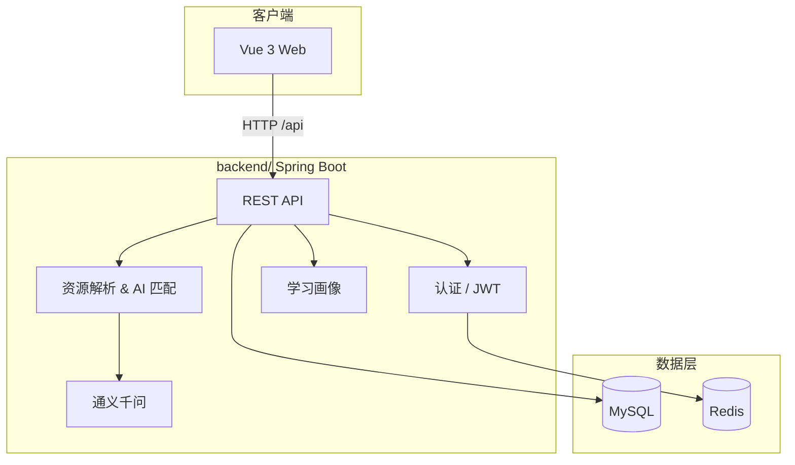

# AIGC 个性化学习平台

[](LICENSE)
[](https://openjdk.org/)
[](https://spring.io/projects/spring-boot)
[](https://vuejs.org/) *(前端开发中)*

面向中国大学生的 **AI 学习伴侣平台**。整合 B 站、小红书、抖音等公开课程链接，结合学习行为分析与大语言模型，为每位学生生成符合个人节奏与应试目标的定制化学习路径。

> 毕业设计项目 · Spring Boot + Vue 3 + MySQL

---

## 功能模块

| 模块 | 说明 | 状态 |
|------|------|------|
| 用户认证 | 注册 / 登录 / 找回密码，JWT + 邮箱验证码 | ✅ 后端已实现 |
| 学习资源管理 | 爬虫数据解析、AI 匹配、资源入库（仅存链接与标签） | ✅ 后端已实现 |
| 学科与知识点 | 学科管理、知识点树、测评题目 | ✅ 后端已实现 |
| 学习画像 | 水平诊断、学习偏好与节奏分析 | ✅ 后端已实现 |
| AI 教师 | 知识归纳、解题引导、变式训练 | 🚧 持续开发 |
| 个性化学习路径 | 规则驱动 + AI 生成，短周期动态调整 | 🚧 持续开发 |
| 学习数据分析 | 掌握雷达图、连续性折线、完成度统计 | 📋 规划中 |
| 前端界面 | Vue 3 用户端与管理端 | 📋 待接入 |

---

## 技术栈

### 后端 `backend/`

| 类别 | 技术 |
|------|------|
| 框架 | Spring Boot 4.0.1 |
| 语言 | Java 17 |
| 数据库 | MySQL + Spring Data JPA |
| 缓存 | Redis |
| 安全 | Spring Security + JWT |
| 邮件 | Spring Mail（QQ SMTP） |
| AI | 阿里云通义千问（OpenAI 兼容接口） |

### 前端 `frontend/` *(规划中)*

| 类别 | 技术 |
|------|------|
| 框架 | Vue 3 |
| 构建 | Vite |
| UI | 待定 |
| 请求 | Axios |

---

## 仓库结构

本仓库采用 **Monorepo（单仓库多项目）** 组织前后端，便于统一版本管理与协作：

```
AIGClearningplatform/
├── LICENSE                 # Apache License 2.0
├── README.md               # 项目总览（本文件）
├── backend/                # Spring Boot 后端
│   ├── pom.xml
│   ├── src/
│   └── README.md           # 后端开发与启动说明
└── frontend/               # Vue 3 前端（待添加）
    └── README.md
```

---

## 快速开始

### 环境要求

- JDK 17+
- Maven 3.8+
- MySQL 8.0+
- Redis 6.0+

### 启动后端

```bash
git clone https://github.com/Fjie17/AIGClearningplatform.git
cd AIGClearningplatform/backend

# 1. 复制并填写配置
cp src/main/resources/application.properties.example src/main/resources/application.properties

# 2. 编辑 application.properties，填入数据库、邮箱、AI API 等配置

# 3. 创建数据库
#    CREATE DATABASE aigc_learning_platform CHARACTER SET utf8mb4;

# 4. 启动服务（默认端口 9090）
./mvnw spring-boot:run        # Linux / macOS
mvnw.cmd spring-boot:run      # Windows
```

详细说明见 [backend/README.md](backend/README.md)。

### 启动前端

前端代码尚未上传。接入后预计步骤：

```bash
cd frontend
npm install
npm run dev
```

---

## 如何添加前端

推荐继续使用当前 **Monorepo** 方案，将 Vue 3 项目放入 `frontend/` 目录：

```bash
# 在已克隆的仓库根目录执行
cd AIGClearningplatform
mkdir frontend

# 将本地 Vue 项目复制进来（排除 node_modules）
robocopy "你的前端项目路径" "frontend" /E /XD node_modules dist .git

# 添加前端 .gitignore（node_modules、dist、.env 等）
# 编写 frontend/README.md
git add frontend/
git commit -m "Add Vue 3 frontend"
git push origin main
```

**前端 `.gitignore` 建议忽略：**

```
node_modules/
dist/
.env
.env.local
*.local
```

**前后端联调：** 在 Vue 项目的 `vite.config.js` 中配置代理，将 `/api` 转发到 `http://localhost:9090`。

---

## 系统架构



---

## API 概览

| 前缀 | 说明 |
|------|------|
| `/api/auth` | 注册、登录、验证码、重置密码 |
| `/api/profile` | 学习画像与测评 |
| `/api/user-subject` | 用户学科关联 |
| `/api/admin/subjects` | 学科管理 |
| `/api/admin/knowledge-points` | 知识点管理 |
| `/api/admin/resources` | 学习资源解析与入库 |
| `/api/admin/assessment-questions` | 测评题目管理 |
| `/api/ai/test` | AI 接口调试 |

---

## 配置说明

敏感配置**不会**提交到仓库。请基于示例文件自行创建：

```
backend/src/main/resources/application.properties.example
                              ↓ 复制为
backend/src/main/resources/application.properties
```

需配置项：MySQL 连接、QQ 邮箱授权码、通义千问 API Key、Redis 地址。

---

## 开发协作建议

| 场景 | 做法 |
|------|------|
| 只改后端 | 在本地 `backend/` 开发 → `git add backend/` → 提交推送 |
| 只改前端 | 在本地 `frontend/` 开发 → `git add frontend/` → 提交推送 |
| 同步本地到仓库 | 从开发目录复制到克隆仓库对应子目录，再 commit |

---

## 许可证

本项目基于 [Apache License 2.0](LICENSE) 开源。

---

## 作者

[Fjie17](https://github.com/Fjie17)
